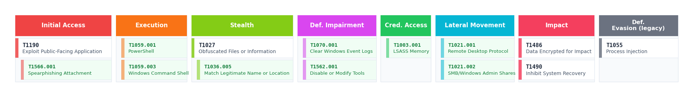

# Remora — DFIR Case Management Platform

> Self-hosted incident response platform built for analysts who want to focus on the investigation — not on the reporting.



---

## Philosophy

Most DFIR platforms treat reporting as an afterthought — you investigate, then you write. Remora inverts this: **reporting happens as you analyse**.

Every action feeds the final report automatically:
- Pin an event from a log file → it lands in the Timeline
- Map a technique in the MITRE matrix → it appears in the report's ATT&CK section
- Tag an IOC while analysing an email → it populates the IOC table in the DOCX export
- Add a node in the attack graph → it renders as an embedded image in the report

By the time the investigation is done, the report skeleton is already filled.

---

## Core Concepts

### Playbook-driven case management

Each case is built around a **playbook** — a reusable investigation checklist tailored to the incident type. Playbooks define the steps an analyst must follow (triage, containment, eradication…), with per-step note editors and completion tracking.

Cases are created from **case templates** (YAML) that bundle:
- Severity, TLP, tags
- Pre-seeded MITRE ATT&CK techniques
- Report sections with per-section content templates
- An executive summary template

Built-in templates: **Ransomware**, **Phishing / BEC**, **CTF / Challenge**, **Default IR**. Custom templates can be created and edited directly from the UI.

### Timeline as the central spine

The **Timeline Explorer** is the backbone of the investigation. Every forensic module — EVTX logs, MFT, USN journal, artifact tables, email analysis — has a **Pin to Timeline** button on every row. Pinned events are sorted chronologically and can be sent to the global case timeline with one click.

The timeline becomes the authoritative sequence-of-events that feeds directly into the report.

### Forensic analysis without leaving the platform

Remora ingests standard acquisition formats and provides in-platform viewers for each:

| Format | Module |
|--------|--------|
| EVTX | Windows Event Logs viewer + Chainsaw Sigma scanning |
| CSV / TSV | Artifact Explorer — DuckDB-powered, RQL queries, grouping, pivot |
| JSON | Tree viewer + raw toggle |
| TXT / LOG | Line viewer with text filter |
| EML | Email Analysis — headers, body, attachments, IOC extraction |
| Binaries | Static analysis — strings, entropy, imports, YARA |
| Memory dumps | Volatility3 integration |
| MFT / USN | Dedicated filesystem timeline viewers |

**Collection Import** accepts ZIPs of mixed artefacts and auto-routes each file to the right module. EVTX files go to the Logs module, EML files to Email Analysis, CSVs to the Artifact Explorer.

### Artifact Explorer & RQL

The Artifact Explorer is a full-featured tabular viewer powered by DuckDB in-process. It supports:
- Column sorting, resizing (drag or double-click to auto-fit), reordering, hiding
- Column filters (per-cell dropdowns) and a global search
- **RQL** (Remora Query Language) — a forensic-oriented DSL:
  ```
  EventID = "4624" AND SubjectUserName contains "admin"
  * contains "mimikatz"                          ← wildcard across all columns
  * REGEX "^\d{1,3}\.\d{1,3}\.\d{1,3}\.\d{1,3}$"
  Timestamp BETWEEN "2024-01-01" AND "2024-12-31"
  ```
- Group-by with expandable groups
- CSV export of filtered results
- Pin any row to the Timeline

---

## Features at a glance

| Category | Details |
|----------|---------|
| **Case management** | Severity, TLP, status, tags, analyst assignment, case types (IR / CTF / Pentest / Sample) |
| **Playbooks** | Reusable checklists, per-step notes with markdown + image paste, completion tracking |
| **Timeline** | Cross-source event timeline, pin from any forensic module, send to report |
| **IOC tracking** | 15+ IOC types (IP, domain, hash, email, URL, registry…), bulk import, CTI enrichment |
| **Asset management** | Hosts, accounts, cloud resources — mark as compromised |
| **Evidence / Chain of Custody** | File upload, integrity hash (MD5 / SHA256), full custody log |
| **EVTX / Logs** | Event log viewer, Chainsaw Sigma scanning, MFT, USN journal, Prefetch, browser artefacts |
| **Email Analysis** | Full EML parsing, header analysis, attachment extraction, IOC auto-extraction |
| **Binary Analysis** | Strings, entropy, LIEF import/export table, Capstone disassembly, YARA |
| **Memory Analysis** | Volatility3 plugin runner |
| **Artifact Explorer** | DuckDB-powered CSV viewer, RQL, grouping, pivot, Timeline integration |
| **MITRE ATT&CK** | ATT&CK v19 matrix (15 tactics), Navigator layer import/export, visual PNG for reports |
| **Attack Graph** | ReactFlow kill-chain builder, exported as embedded image in DOCX reports |
| **CTI Lookup** | VirusTotal + AbuseIPDB per IOC, configurable from UI |
| **Knowledge Base** | Shared markdown notes with image paste, wikilinks, vault file attachments |
| **Report generation** | DOCX + Markdown export, template tags, analyst-authored sections, auto-generate skeleton |
| **Report templates** | DOCX/MD templates with `{{ioc_table}}`, `{{mitre_matrix_img}}`, `{{attack_graph}}`, per-section `{{slug}}` tags |
| **Case templates** | YAML-defined templates with MITRE seeding, report sections, executive summary |
| **Dashboard** | KPI cards, MTTR, activity chart, analyst workload, open case severity breakdown |
| **Audit log** | Full action trail |
| **Multi-user** | JWT auth, admin / analyst roles, per-user timezone |
| **Backup** | One-click full backup download (authenticated) |

---

## Auto-reporting

The report is never written from scratch. The workflow:

1. **As you investigate** — pin events to the Timeline, map TTPs in MITRE, add IOCs, build the attack graph.
2. **In the Report tab** — write analysis notes in per-section markdown editors (sections defined by your case template). Executive Summary and Quick Notes available in the right panel.
3. **Auto-generate** — one click pre-fills each section with the template skeleton from the case template YAML.
4. **Export** — DOCX or Markdown, with template tags replaced by live data:

```
{{report_content}}        ← your analyst notes
{{ioc_table}}             ← all IOCs in a formatted table
{{asset_table}}           ← asset inventory
{{timeline_table}}        ← chronological event timeline
{{mitre_matrix_img}}      ← visual ATT&CK matrix PNG
{{attack_graph}}          ← kill-chain graph PNG
{{reconnaissance}}        ← per-section slug (from case template)
```

Report templates are fully customisable — upload a DOCX with `{{tags}}` and Remora fills them in at export time.

---

## Quick Start — Docker

> **Requirements:** Docker Engine 24+ and Docker Compose v2.

### 1. Clone & configure

```bash
git clone https://github.com/Ch4rybd3/Remora.git
cd Remora
cp .env.example .env
```

Edit `.env`:

```dotenv
# Generate with: python3 -c "import secrets; print(secrets.token_hex(32))"
SECRET_KEY=your_random_hex_key_here

# Password for the default admin account (default: admin)
DEFAULT_ADMIN_PASSWORD=change_me
```

### 2. Build & launch

```bash
docker compose up --build
```

First build: ~2–3 min. Subsequent starts: a few seconds.

### 3. Open

```
http://localhost:5577
```

Login: **admin** / your `DEFAULT_ADMIN_PASSWORD`.  
Swagger UI: `http://localhost:5577/api/v1/docs`

---

## Configuration

| Variable | Required | Default | Description |
|----------|----------|---------|-------------|
| `SECRET_KEY` | **Yes** | — | JWT signing key. Changing it invalidates all active sessions. |
| `DEFAULT_ADMIN_PASSWORD` | No | `admin` | Password for the built-in admin account on first startup. |
| `PORT` | No | `5577` | Host port exposed by nginx. |
| `CHAINSAW_BIN_PATH` | No | — | Path to the Chainsaw binary inside the container. |
| `CHAINSAW_RULES_PATH` | No | — | Path to Sigma rules directory for Chainsaw. |

---

## Optional Integrations

### Chainsaw (EVTX Sigma scanning)

Chainsaw is not bundled. To enable:

```bash
# Copy the Linux binary and rules into the data volume
docker cp chainsaw remora-backend:/app/data/chainsaw/chainsaw
docker cp sigma_rules/ remora-backend:/app/data/chainsaw/rules/
```

Then set in `.env`:
```dotenv
CHAINSAW_BIN_PATH=/app/data/chainsaw/chainsaw
CHAINSAW_RULES_PATH=/app/data/chainsaw/rules
```

Restart: `docker compose restart backend`

### CTI Enrichment (VirusTotal / AbuseIPDB)

Configure API keys from the UI: **Settings → Connectors**. No `.env` changes needed.

---

## Data Persistence

All data lives in the `remora_data` Docker volume:

```
remora_data/
├── remora.db           ← SQLite database
├── evidences/          ← Uploaded evidence files
├── note_images/        ← Images pasted in notes and playbooks
├── knowledge/          ← Knowledge base attachments
├── chainsaw/           ← Chainsaw binary & Sigma rules
├── mitre/              ← ATT&CK technique cache
└── report_doc_templates/ ← Uploaded DOCX report templates
```

**Backup:**
```bash
docker run --rm \
  -v remora_data:/data -v $(pwd):/backup \
  alpine tar czf /backup/remora_backup_$(date +%Y%m%d).tar.gz -C /data .
```

Or use the one-click **Backup** button in the app (Settings → Backup).

**Restore:**
```bash
docker run --rm \
  -v remora_data:/data -v $(pwd):/backup \
  alpine tar xzf /backup/remora_backup_YYYYMMDD.tar.gz -C /data
```

---

## Development Setup

> **Requirements:** Python 3.12+, Node.js 20+

### Backend
```bash
cd backend
python3 -m venv .venv && source .venv/bin/activate
pip install -r requirements.txt
uvicorn app.main:app --reload --host 0.0.0.0 --port 8000
```

### Frontend
```bash
cd frontend
npm install
npm run dev   # Vite dev server at http://localhost:5173
```

---

## Tech Stack

| Layer | Technology |
|-------|------------|
| **Backend** | Python 3.12, FastAPI, SQLAlchemy 2, SQLite, pydantic-settings v2, uvicorn |
| **Query engine** | DuckDB (in-process CSV/artefact querying) |
| **Frontend** | React 18, TypeScript, Vite, TanStack Query v5, Tailwind CSS |
| **Rich editors** | Tiptap (WYSIWYG markdown with image paste) |
| **Graph** | ReactFlow (attack graph builder) |
| **Auth** | JWT (python-jose), bcrypt |
| **Forensics** | python-evtx, lief, capstone, volatility3, python-docx, matplotlib, Chainsaw |
| **Serving** | nginx 1.27 (SPA + API reverse proxy) |
| **Deployment** | Docker multi-stage build, Docker Compose |

---

## Project Structure

```
Remora/
├── backend/
│   ├── app/
│   │   ├── main.py          ← FastAPI app, startup migrations, router registration
│   │   ├── models/          ← SQLAlchemy models (one per feature)
│   │   ├── routers/         ← API endpoints (one file per feature)
│   │   ├── schemas/         ← Pydantic request/response schemas
│   │   └── services/        ← Business logic (RQL parser, report generator…)
│   └── requirements.txt
├── frontend/
│   ├── src/
│   │   ├── api/             ← Typed API clients
│   │   ├── components/      ← UI components and forensic explorers
│   │   ├── pages/           ← Top-level page components
│   │   └── context/         ← Auth, CurrentCase, Timezone contexts
│   └── package.json
├── templates/               ← Default case templates (YAML)
├── nginx.conf
├── docker-compose.yml
└── .env.example
```

---

## License

Private — all rights reserved.
